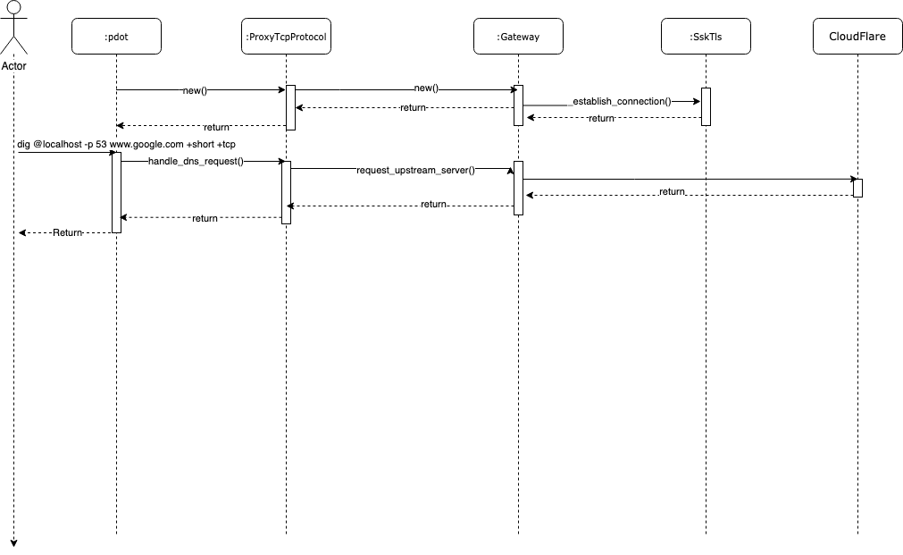

PyDot
---

> Here I design and create a simple DNS to DNS-over-TLS proxy that we could use to enable our application to query a
DNS-over-TLS server.
>
```bash
+-----------------+                   +------------------+              +---------------------+
|                 |                   |                  |              |                     |
|  Client         +-----DNS / TCP-----+       PyDot      +--DNS / TLS---+    CloudFlare       |
|                 |                   |                  |              |                     |
+-----------------+                   +------------------+              +---------------------+
```

__ToC__
+ [Architecture](#Architecture)
+ [Installing PyDot](#Install)
+ [Using PyDot](#Usage)
+ [Deployment](#Deployment)
+ [Security](#Security)
+ [Running tests](#Testing)
+ [Thing To Improve](#Things To Improve)
+ [References](#References)

# Architecture
Here is the Diagram Class:


Here is the TCP Diagram Sequence:


Here is the UDP Diagram Sequence:


# Install
Using docker-compose
```bash
$ docker-compose up -d
```
Using dockerfile
```bash
$ docker build . -t py-dot:qa
$ docker run -d -p 127.0.0.1:53:53/tcp -p 127.0.0.1:53:53/udp py-dot:qa
```
Using as binary
```bash
$ cd src
$ pip3 install -r requirements.txt
$ chmod +x pdot.py
$ ./pdot.py --help        
2020-07-10 12:18:57,679 DNS_TLS_PROXY 22513 DEBUG  <module> Starting 'DNS_TLS_PROXY' server
usage: pdot.py [-h] [--listen-ip LISTEN_IP] [--tcp-port TCP_PORT]
               [--udp-port UDP_PORT] [--upstream-server UPSTREAM_SERVER]
               [--upstream-port UPSTREAM_PORT] [-d]

DNS Proxy over TLS

optional arguments:
  -h, --help            show this help message and exit
  --listen-ip LISTEN_IP
                        Listen IP to the server. Default: 0.0.0.0
  --tcp-port TCP_PORT   TCP port to listen. Default: 53
  --udp-port UDP_PORT   UDP port to listen. Default: 53
  --upstream-server UPSTREAM_SERVER
                        Upstream Server. Default: "one.one.one.one"
  --upstream-port UPSTREAM_PORT
                        Upstream port. Default: "853"
  -d, --debug           DEBUG log level

$ ./pdot.py
2020-07-10 12:22:12,621 DNS_TLS_PROXY 22546 DEBUG  <module> Starting 'DNS_TLS_PROXY' server
2020-07-10 12:22:13,188 DNS_TLS_PROXY 22546 INFO   main     DNS/TLS proxy started. listening on (TCP) 0.0.0.0:53
2020-07-10 12:22:13,278 DNS_TLS_PROXY 22546 INFO   main     DNS/TLS proxy started. listening on (UDP) 0.0.0.0:53
```
# Usage:
Test DNS over TCP
```bash
$ dig @localhost -p 53 www.google.com +short +tcp
```
Test DNS over UDP
```bash
$ dig @localhost -p 53 www.google.com +short
```
# Deployment:
The alternatives to deploy this application can be as a "sidecar", it is as an application inside the same POD with our
application in Kubernetes.
Another alternative could be deploy in Kubernetes, Docker Swarm, Nomad, etc and then register the container in some
network laod balancer.

# Security:
>
> There are same security consideration that we must pay attention.
>
> - Man In the Middle
> - DoS
> - Byte Corruption

# Testing
Generate Test
```bash
$ cd src
$ coverage erase 
$ coverage run tests.py
```
Show Report on console
```
$ coverage report
```
Get HTML Report:
Run the below command and then open with the navigator the html file /src/htmlcov/index.html
```bash
$ coverage html
```

# Things To Improve:
- Add Connection Reuse as part of RFC
- Add DNS CACHE, probably using [DNSLIB](https://pypi.org/project/dnslib/)
- Improve Exception Handling
- Improve Documentation
- Improve TEST
- Add Health Check endpoint
- Add Metrics
# References:
- Python.org, "Streams",https://docs.python.org/3.4/library/asyncio-stream.html#asyncio.StreamReader.read
- Python.org, "Asyncio",https://docs.python.org/3/library/asyncio.html
- CloudFlare, "DNS over TLS", https://developers.cloudflare.com/1.1.1.1/dns-over-tls/
- Wikpedia, "DNS over TLS", https://en.wikipedia.org/wiki/DNS_over_TLS
